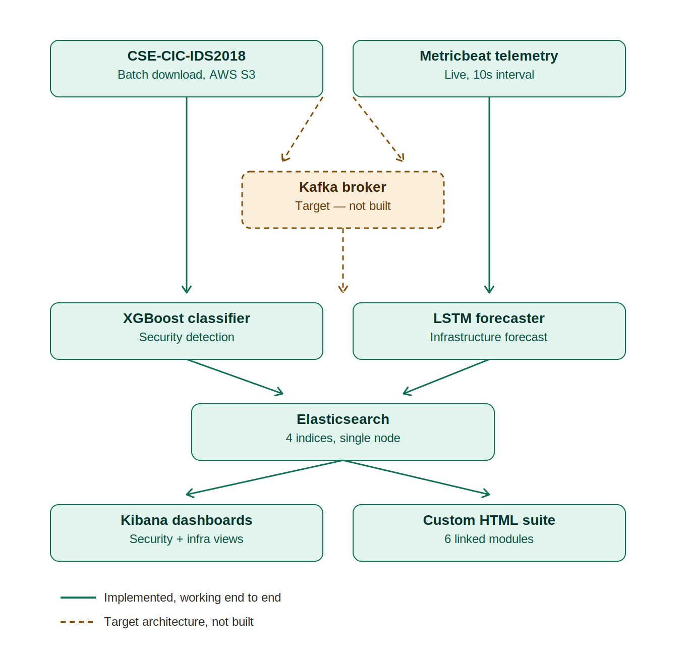

# AISecOpt — Architecture and Design Rationale

This document explains *why* the system is built the way it is. Where a choice was made, the alternatives considered and the reason for rejecting them are stated.

---

## 1. Data flow

Two independent ingestion paths converge on a single Elasticsearch instance, which serves two presentation layers.

**Security path.** CSE-CIC-IDS2018 flow records → Python preprocessing → XGBoost classification → SHAP explanation → MITRE ATT&CK mapping → Elasticsearch (`ai-secopt-threats-*`).

**Infrastructure path.** Metricbeat agent → Elasticsearch (`metricbeat-*`) → Python extraction and resampling → LSTM forecasting → Elasticsearch (`ai-secopt-forecasts-*`, `ai-secopt-actuals-*`).

**Presentation.** Kibana dashboards for analytical exploration; five custom HTML modules for the purpose-built operator interface.

---

## 2. Component choices and rationale

### Elastic Stack over Splunk, Wazuh, or a bespoke engine

The project brief explicitly required integrating an existing SIEM rather than building one. Three candidates were considered.

**Splunk** is the market-leading commercial SIEM, but its licensing model prices on ingested data volume, making a million-record research dataset prohibitively expensive without institutional licensing.

**Wazuh** is open-source and security-focused, but it is built primarily around host-based intrusion detection with its own agent and rule format. Integrating custom Python model outputs would have meant working against its design rather than with it.

**Elastic Stack** was selected because Elasticsearch is a general-purpose document store with a well-documented REST API, which makes ingesting arbitrary JSON — such as a prediction accompanied by SHAP values — straightforward. Metricbeat provides infrastructure collection from the same vendor, avoiding an additional integration. It is free at the scale used here, and the Docker deployment path removes installation friction.

The trade-off is honest: Elasticsearch is a search engine with SIEM tooling layered on top, not a purpose-built SIEM. Splunk's correlation search capabilities are more mature. For this project, extensibility and cost mattered more than out-of-the-box correlation features, because the correlation logic being demonstrated is the ML model, not the SIEM engine.

### XGBoost over deep learning or classical alternatives

The security data is tabular: 78 numerical flow-statistics features per record. This matters, because gradient-boosted tree ensembles consistently outperform neural networks on tabular data at this scale, and the literature on CSE-CIC-IDS2018 specifically reflects this.

**Deep neural networks** were considered and rejected. They offer no accuracy advantage on structured tabular features, require substantially more tuning, and are less interpretable — a significant drawback given explainability is central to this project's contribution.

**Random Forest** would have been a reasonable alternative and is genuinely competitive. XGBoost was preferred for its sequential error-correction (each tree targets the residuals of its predecessors), superior handling of class imbalance through weighting, and native compatibility with SHAP's `TreeExplainer`, which is dramatically faster than model-agnostic explanation methods.

**Support Vector Machines** scale poorly to a million-row training set with high-dimensional features.

### LSTM over ARIMA or Prophet for forecasting

Infrastructure telemetry is a multivariate time series: CPU, memory, and network metrics that plausibly interact.

**ARIMA** is well-established for univariate time series but does not natively handle multivariate input and assumes stationarity, which resource-utilisation data violates.

**Prophet** handles seasonality well but is designed for business time series at daily or weekly granularity, not 10-second infrastructure sampling.

**LSTM** was selected because it accepts multivariate sequences directly, learns non-linear temporal dependencies without a stationarity assumption, and can produce multi-step-ahead forecasts in a single pass. The architecture used is deliberately modest — stacked 64/32 units, 32,234 parameters — sized to the available training data rather than to what the framework permits.

### SHAP over LIME or built-in feature importance

**XGBoost's native feature importance** describes the model globally but cannot explain an individual prediction, which is what a security analyst investigating a specific alert actually needs.

**LIME** provides local explanations but approximates the model with a surrogate, and its explanations can be unstable across runs.

**SHAP** was selected because it is grounded in Shapley values from cooperative game theory, giving explanations with a defensible theoretical basis; it produces both global and per-prediction views from the same computation; and `TreeExplainer` exploits tree structure directly, making it fast enough to generate explanations for thousands of events.

---

## 3. Methodological decisions

### Stratified sampling at 150,000 records per class

The full cleaned dataset contains 13,668,745 records. Training on all of it was rejected for two reasons: available memory made it impractical, and — more importantly — it was unnecessary. Beyond a few hundred thousand well-distributed examples per class, additional records of the same underlying patterns yield diminishing returns, while training time continues to grow. A 150,000-record cap retains 1,041,092 records across 15 classes, preserving every instance of the rare classes while bounding the majority ones.

### Preprocessing order: split, then scale, then resample

This ordering is not arbitrary and is the single most consequential methodological decision in the project.

The train/test split happens first. The `MinMaxScaler` is then fitted on the training partition alone and merely *applied* to the test partition. SMOTE is applied only to the training partition.

Reversing any of these steps introduces data leakage. Fitting the scaler on the full dataset lets test-set feature ranges influence the transformation applied to training data. Applying SMOTE before splitting places synthetic records — and records interpolated from test-set neighbours — into the test set, so the model is partly evaluated on data derived from itself.

Both errors inflate reported metrics while leaving no visible symptom. A verification step confirms the correct ordering: after scaling, the test partition ranges from −0.000 to 1.002, slightly exceeding the [0,1] bounds. That overshoot is the expected signature of a scaler fitted only on training data encountering a more extreme test value. A test set landing exactly on [0,1] would indicate leakage.

### Dropping identifier columns

`Flow ID`, `Src IP`, `Dst IP`, and `Src Port` were removed before training. A model retaining them can achieve high accuracy by memorising which addresses generated attack traffic in this particular capture — a shortcut that produces excellent benchmark scores and no generalisation whatsoever.

This decision has a real downstream cost, and it is a genuine trade-off rather than a free win: because source and destination addresses are absent, the system cannot attribute a detection to a specific device. Device-level attribution and leakage-free classification are in direct tension, and this project prioritised the latter.

`Protocol` and `Dst Port` were retained. Protocol is behavioural and low-cardinality. Destination port is more debatable — SHAP analysis subsequently showed it to be by far the most influential feature, raising a legitimate question about whether the model has partly learned service-port associations specific to this dataset rather than transferable attack behaviour. This is examined in the dissertation's evaluation chapter.

### Chunked processing with atomic writes

The cleaning pipeline reads each daily file in 200,000-row chunks, writes to a `.tmp` file, and renames only on successful completion.

This design emerged from failure. Earlier versions accumulated all ten cleaned dataframes in memory before concatenating, which exhausted RAM partway through the largest file (7.9 million rows). Worse, an intermediate version left a partially-written Parquet file behind on crash, and the "skip files already processed" check accepted it as complete — silently propagating corrupt data downstream until an integrity check caught it.

The atomic rename makes the completeness check trustworthy: if a file exists under its final name, it is complete by construction.

One consequence must be acknowledged. Deduplication operates within chunks rather than across the whole file, so duplicates spanning chunk boundaries survive. This is a deliberate trade-off accepted to make processing feasible within memory constraints.

### Type coercion during chunked reads

Pandas infers column types per chunk. A column containing only whole numbers in one chunk and decimals in another is inferred inconsistently, and the Parquet writer rejects the schema mismatch. The pipeline therefore coerces every non-label column to `float64` explicitly.

Coercion also handles a genuine data-quality issue in the source dataset: several daily files contain repeated header rows embedded mid-file, an artefact of how the original captures were concatenated. `pd.to_numeric(errors='coerce')` converts these to `NaN`, and the existing null-dropping step removes them.

---

## 4. Dashboard design rationale

Each module maps to a specific research objective. Panels not backed by real system output are labelled as illustrative rather than presented as functional.

**A note on the hosted version.** The six dashboard files are additionally published via GitHub Pages for direct access without local setup. That hosted copy demonstrates the interface, navigation and design correctly, but its live-data panels do not populate — every module queries `http://localhost:9200`, an address that only resolves on a machine running the project's own Docker stack. This is a deliberate scope boundary consistent with the honest-labelling principle applied throughout the artefact, not an oversight: the hosted link is evidence of the interface design (Chapter 3 of the dissertation); live operation is demonstrated by running the system locally per `docs/SETUP.md`, or by the saved output already committed in the notebooks.

| Module | Objective served | Data source |
|---|---|---|
| SOC Dashboard | Unified monitoring; correlating security and infrastructure views | Live: `ai-secopt-threats-*`, `metricbeat-*` |
| Threat Intelligence Console | MITRE ATT&CK mapping; explainable detection | Live: aggregated technique counts, SHAP feed |
| LSTM Forecasting Engine | Predictive infrastructure monitoring | Live: `ai-secopt-actuals-*`, `ai-secopt-forecasts-*` |
| ML Training Lab | Model evaluation transparency | Static: real measured metrics |
| Data Pipeline Engineer | Ingestion architecture visibility | Live: Elasticsearch index statistics |
| Incident Correlation Console | Cross-signal correlation; incident reporting | Live: overlap check across both streams, plus labelled simulation |

**Honest labelling.** Several panels present capability the prototype does not have — multi-node infrastructure cards, a Kafka broker, IOC threat-feed matching, multi-stage attack campaign correlation. Rather than removing them or presenting them as functional, each carries an explicit label marking it as target architecture or illustrative simulation. This preserves the design intent while ensuring nothing on screen misrepresents what was built.

### The Incident Correlation Console

This module was added to address the project's stated correlation objective directly, and its design reflects an honest position on what could and could not be demonstrated.

The upper section is genuinely live. It queries the most recent CPU reading, the most recent memory reading, and the most recent classified attack detection, then computes the actual time delta between the detection and the telemetry. Where the delta falls within five minutes it reports a plausible correlation; otherwise it reports no overlap and states why.

Against the populated indices it reports no overlap — correctly. The security detections carry 2018 timestamps inherited from the source capture, while the telemetry is contemporaneous. This is not a defect in the correlation logic, which functions as designed; it is an empirical demonstration of the data-source disjunction discussed in §5. The distinction matters for evaluation: the mechanism exists and is verifiably operational, and only temporally aligned data is absent.

The lower section is an explicitly labelled simulation of an eight-node datacentre, demonstrating the correlation and incident-reporting engine on synthetic events. It includes metrics the prototype cannot collect — temperature, power draw, and cooling supply temperature — which are not obtainable through Metricbeat and are not exposed to cloud tenants. These illustrate target capability, not implemented capability, and the module labels them as such.

If Elasticsearch is unreachable, the page catches the failure, marks the connection state, and explains what to start. It does not silently render empty panels.

### Replacing the IOC panel

The IOC panel was replaced entirely rather than labelled. It originally displayed IP addresses, file hashes, and domains — none of which the system can produce, since identifier columns were deliberately dropped. It now shows recent high-confidence detections with their top SHAP contributing feature, which is genuine model output and more directly demonstrates the project's contribution.

---

## 5. What was scoped out, and why

**Apache Kafka.** A message broker would decouple ingestion from inference and support replay. It was scoped out because the prototype's throughput requirements do not justify the additional deployment complexity, and the time was better spent on the ML contribution. The target architecture is documented in the diagram and dashboard.

**Isolation Forest.** An unsupervised anomaly detector would complement the supervised classifier and potentially catch zero-day patterns. Excluded to preserve focus on the two-model architecture central to the research question.

**Live packet capture.** Running CICFlowMeter against live traffic would enable genuine real-time detection. Excluded because a labelled benchmark dataset was necessary for rigorous, reproducible evaluation against known ground truth — which self-generated traffic could not provide within the project timeline. This is the single largest gap between the conceptual framework and the implemented prototype.

**Automated alerting.** Alerts are displayed but not dispatched. No email, webhook, or notification integration exists.
